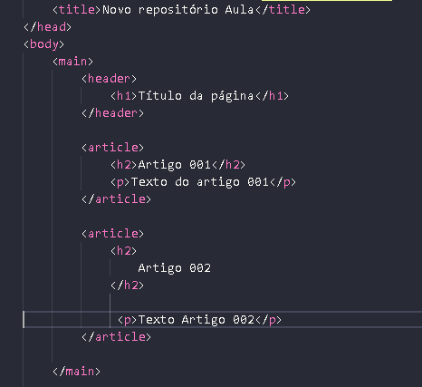
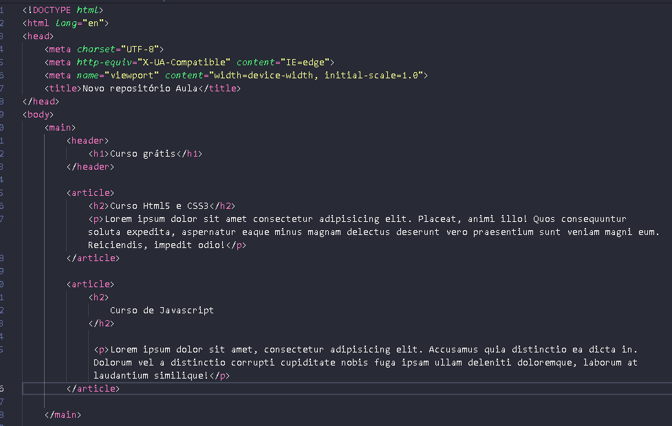
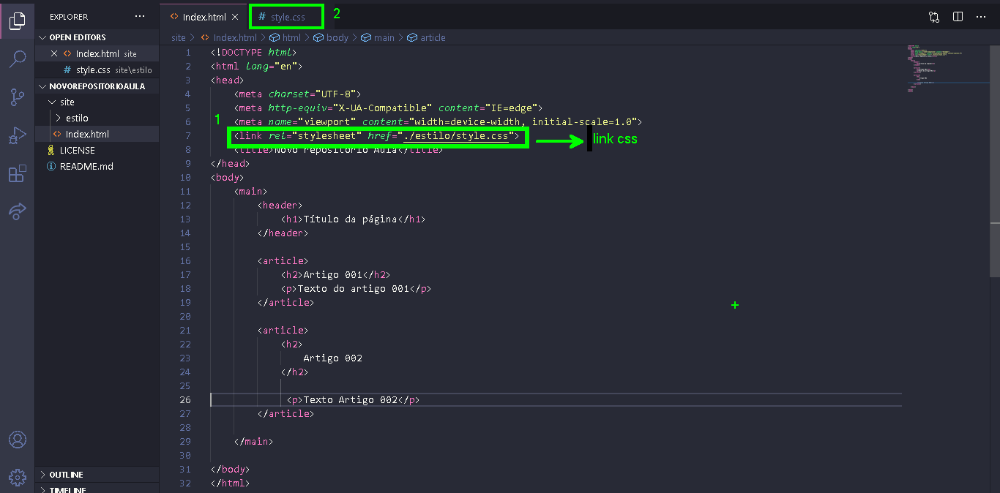

# NovoRepositorioAula
Teste para praticar

---

Este repositório consiste em um teste para praticar alguns conceitos relacionados a Git e GitHub:

- Clonar repositórios
- Criar novas branches 
- Fazer merges para a branch main

## Tecnologias 

Para realizar o versionamento foi utilizado :
1.  **GitHub Desktop**  --> [GitHub Desktop](https://desktop.github.com/)
2.  **Vs Code** --> [download](https://code.visualstudio.com/Download)

## Desenvolvimento
Foi criado duas merges , conteudo (simular uma equipe responsável pelo html) e design (equipe responsável pelo css) e depois um merge para a branch main

1. Código da branch main antes do merge                   

                                 

2. Branch conteudo (html)

3. Branch Design (css)

---

### Branch Main depois do merge

